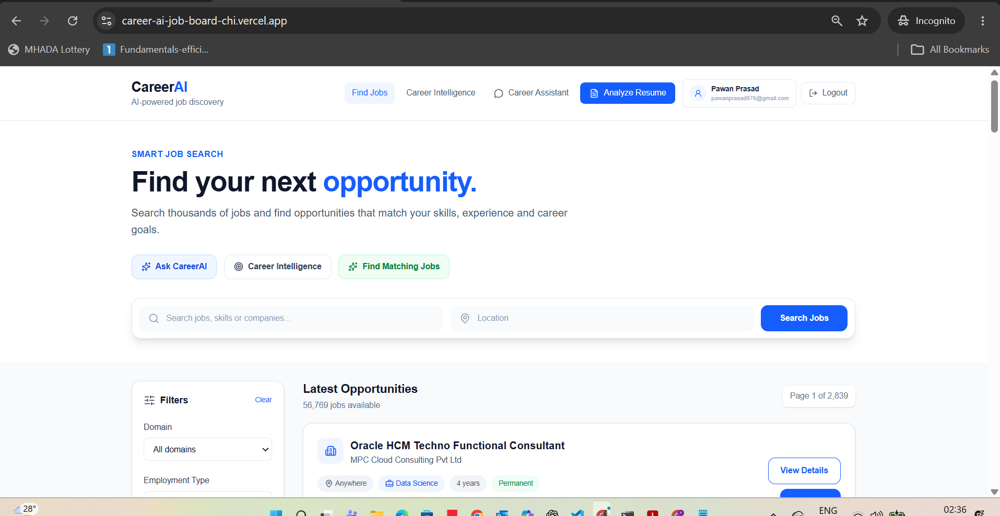
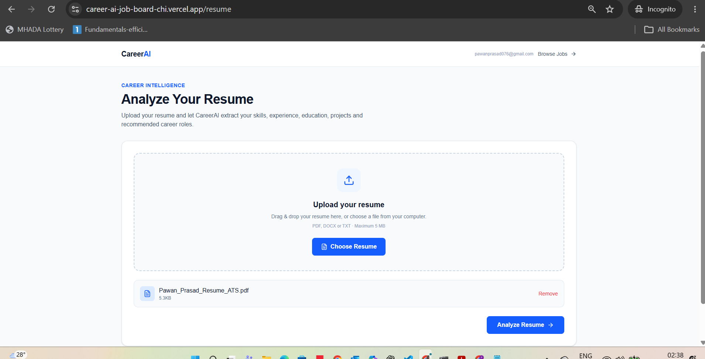
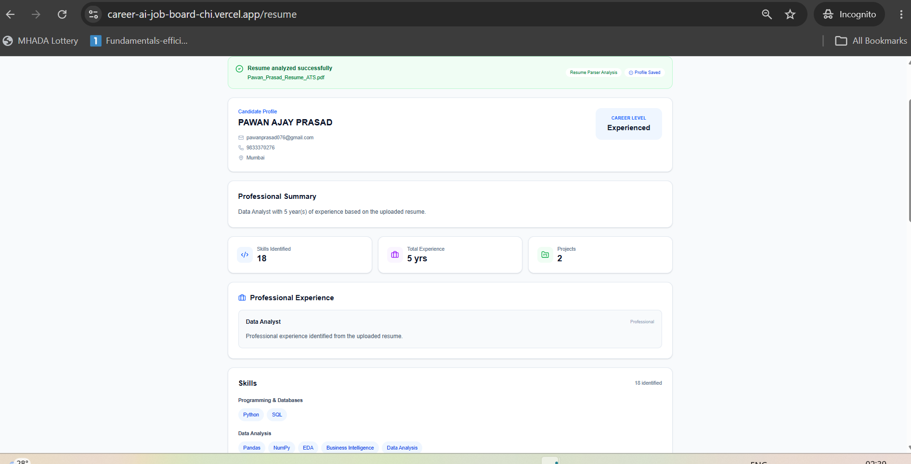
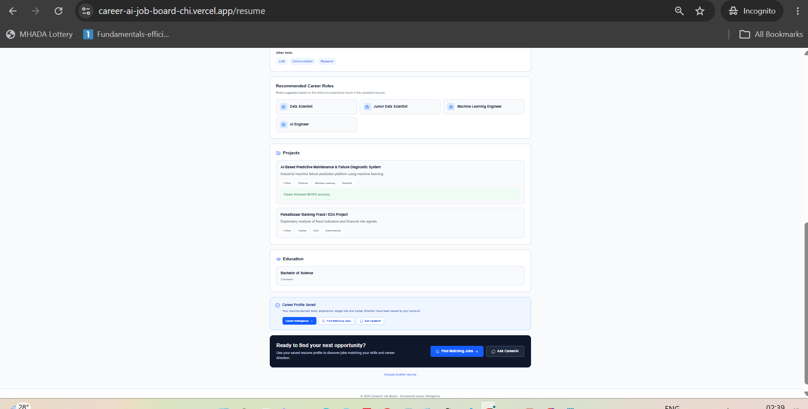
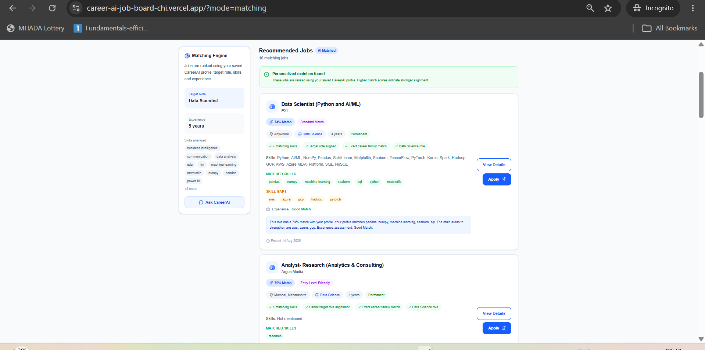
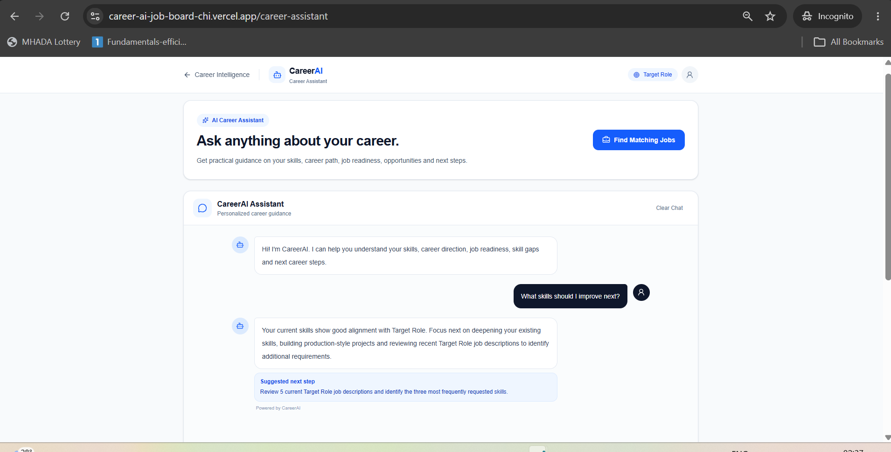

# 🚀 CareerAI — AI-Powered Career Intelligence & Job Matching Platform

<p align="center">

<a href="https://career-ai-job-board-chi.vercel.app/">

</a>

<a href="https://github.com/PAWAN0207/career-ai-job-board">

</a>

<a href="https://drive.google.com/file/d/1h6uhdMjTJr1B4_7SNQhz_5jW-gmMFBfh/view">

</a>

</p>

---

## 📌 Submission Links

| Resource | Link |
|---|---|
| 🌐 **Live Application** | [Open CareerAI](https://career-ai-job-board-chi.vercel.app/) |
| 💻 **GitHub Repository** | [View Source Code](https://github.com/PAWAN0207/career-ai-job-board) |
| 🎥 **Explanation Video** | [Watch Project Walkthrough](https://drive.google.com/file/d/1h6uhdMjTJr1B4_7SNQhz_5jW-gmMFBfh/view) |
| 👤 **LinkedIn** | [Connect with Pawan Prasad](https://www.linkedin.com/in/pawan-prasad-analyst/) |

> **Video access:** Set the Google Drive permission to **Anyone with the link → Viewer** before submission.

---

# 📖 Project Overview

**CareerAI** is a full-stack AI-powered Job Board and Career Intelligence platform designed to make job discovery more personalized, explainable, and actionable.

Traditional job boards primarily answer:

> **"What jobs are available?"**

CareerAI goes one step further:

> **"Which jobs are relevant to me?"**  
> **"How well does my profile match this opportunity?"**  
> **"What skills am I missing?"**  
> **"What should I improve next?"**

The platform combines:

- 🔎 Intelligent job discovery
- 🎛️ Multi-dimensional job filtering
- 🏢 Job-source filtering
- 📄 Resume parsing and profile extraction
- 🧠 Career profile generation
- 🎯 Personalized job recommendations
- 📊 Explainable match signals
- 🧩 Skill-gap identification
- 🤖 Gemini-powered AI Career Assistant
- 🔐 User authentication and profile persistence
- ☁️ Cloud database and public deployment

The system is designed as a reusable **career decision-support platform** rather than a static job-listing demonstration.

---

# 🎯 Problem Statement

Job seekers commonly face three major challenges:

1. **Information overload** — large numbers of job listings make relevant opportunities difficult to identify.
2. **Weak personalization** — traditional job boards do not deeply connect a candidate's profile with job requirements.
3. **Unclear next steps** — candidates may know their target role but not understand their skill gaps or readiness.

CareerAI addresses these challenges through an end-to-end workflow:

```text
Candidate
   │
   ▼
Resume Upload
   │
   ▼
Resume Intelligence
   │
   ▼
Structured Career Profile
   │
   ├───────────────┐
   ▼               ▼
Candidate Skills   Target Roles
   │               │
   └───────┬───────┘
           ▼
      Job Matching
           │
      ┌────┴────┐
      ▼         ▼
Matched Skills  Skill Gaps
      │         │
      └────┬────┘
           ▼
  Personalized Jobs
           │
           ▼
  Career Intelligence
           │
           ▼
 AI Career Assistant
```

---

# ✨ Key Features

## 🔎 1. Intelligent Job Discovery

CareerAI provides a structured job-discovery experience where users can search, filter, and explore opportunities using multiple job attributes.

### Search & Filtering

Users can filter jobs using:

- 🔍 Keyword search
- 📍 Location
- 🧩 Domain
- 💼 Employment type
- 📊 Minimum experience
- 📊 Maximum experience
- 🗂️ Job source
- 📄 Pagination

Search can consider:

- Job title
- Company name
- Skills
- Roles
- Location
- Domain
- Experience requirements
- Employment type

### Supported Job Sources

CareerAI supports job data from multiple sources, including:

- LinkedIn
- Indeed
- Internshala
- Naukri Dekhe
- Naukri Safar
- Glassdoor
- Foundit.in
- Wellfound
- Shine
- Cutshort

The application normalizes source information so users can filter opportunities through a single interface.

<details>
<summary><strong>📸 View Job Discovery Screenshot</strong></summary>

<br>



</details>

---

## 📄 2. AI-Powered Resume Intelligence

CareerAI allows users to upload a resume and transform unstructured resume content into structured career information.

### Supported Formats

- PDF
- DOCX
- TXT

### Extracted Information

The resume workflow can identify and organize:

- Candidate name
- Contact information
- Professional summary
- Skills
- Work experience
- Education
- Projects
- Recommended career roles

Instead of treating a resume as a static document, CareerAI converts it into reusable candidate context for downstream career workflows.

<details>
<summary><strong>📸 View Resume Upload Screenshot</strong></summary>

<br>



</details>

---

## 🧠 3. Structured Career Profile

After resume processing, CareerAI generates a structured career profile that can be reused across the platform.

The profile can contain:

- Candidate information
- Career level
- Skills
- Experience
- Education
- Projects
- Target career direction
- Recommended career roles

This profile becomes the foundation for personalized job matching and career intelligence.

<details>
<summary><strong>📸 View Candidate Profile</strong></summary>

<br>



</details>

<details>
<summary><strong>📸 View Career Profile & Projects</strong></summary>

<br>



</details>

---

## 🎯 4. Explainable Job Matching

CareerAI does not simply return a list of jobs.

The platform compares candidate information with job requirements and exposes matching signals that help users understand **why an opportunity may be relevant**.

### Matching Signals

The recommendation workflow considers:

- Candidate skills
- Job skills
- Target role
- Job domain
- Job roles
- Experience requirements
- Career-family relevance
- Skill overlap

### Recommendation Information

Recommendations can expose:

- 📊 Match score
- ✅ Matched skills
- ⚠️ Skill gaps
- 💼 Experience assessment
- 🎯 Target-role alignment
- 🧩 Career-family relevance
- 🔗 Job details
- 📝 Application availability

This makes the recommendation workflow more transparent and actionable.

<details>
<summary><strong>📸 View Personalized Job Matching</strong></summary>

<br>



</details>

---

## 🤖 5. AI Career Assistant

CareerAI includes a conversational AI assistant powered by **Google Gemini**.

The assistant is designed around career-related context and can help users with:

- Career direction
- Skill development
- Job readiness
- Skill-gap analysis
- Target-role preparation
- Interview preparation
- Career planning
- Practical next steps

### Example Questions

```text
What skills should I improve next?

Am I ready for a Data Scientist role?

What are the most important skill gaps in my profile?

What should I learn for my target role?

How can I improve my job readiness?

What should be my next career step?
```

The AI assistant acts as a career decision-support layer rather than only a generic chatbot.

<details>
<summary><strong>📸 View AI Career Assistant</strong></summary>

<br>



</details>

---

## 🔐 6. Authentication & Profile Persistence

CareerAI includes authenticated user workflows to support personalized career experiences.

The application supports:

- User authentication
- Protected career workflows
- User-specific career information
- Resume-derived profile persistence
- Personalized recommendations

This allows the platform to support a reusable user journey rather than a one-time analysis.

---

## ☁️ 7. Cloud-Based Application

CareerAI is structured as a complete full-stack application with separate frontend and backend layers.

The architecture includes:

- Next.js web application
- FastAPI REST API
- Supabase PostgreSQL
- Supabase Authentication
- Google Gemini integration
- Resume processing
- Job matching
- Cloud deployment

---

# 🛠️ Technology Stack

| Layer | Technology |
|---|---|
| Frontend | Next.js, React, TypeScript |
| UI / Styling | Tailwind CSS |
| Backend | Python, FastAPI |
| Database | Supabase PostgreSQL |
| Authentication | Supabase Authentication |
| AI / LLM | Google Gemini |
| Resume Processing | PyPDF, python-docx |
| API | REST / JSON |
| Frontend Deployment | Vercel |
| Backend Deployment | Render |
| Version Control | Git, GitHub |

---

# 🏗️ System Architecture

CareerAI follows a modular full-stack architecture where the frontend communicates with the FastAPI backend through REST APIs.

```text
                         ┌─────────────────────┐
                         │        User         │
                         └──────────┬──────────┘
                                    │
                                    ▼
                         ┌─────────────────────┐
                         │   Next.js Frontend  │
                         │ React + TypeScript  │
                         │   Tailwind CSS      │
                         └──────────┬──────────┘
                                    │
                               REST / JSON
                                    │
                                    ▼
                         ┌─────────────────────┐
                         │   FastAPI Backend   │
                         │       Python        │
                         └──────────┬──────────┘
                                    │
          ┌─────────────────────────┼─────────────────────────┐
          │                         │                         │
          ▼                         ▼                         ▼
 ┌─────────────────┐      ┌─────────────────┐      ┌─────────────────┐
 │  Job Discovery  │      │     Resume      │      │    Career       │
 │  & Filtering    │      │  Intelligence   │      │  Intelligence   │
 └────────┬────────┘      └────────┬────────┘      └────────┬────────┘
          │                        │                         │
          │                        ▼                         │
          │               ┌─────────────────┐                │
          │               │ Career Profile  │                │
          │               └────────┬────────┘                │
          │                        │                         │
          └────────────────────────┼─────────────────────────┘
                                   ▼
                         ┌─────────────────────┐
                         │ Recommendation &    │
                         │ Matching Logic      │
                         └──────────┬──────────┘
                                    │
                         ┌──────────┴──────────┐
                         ▼                     ▼
                ┌─────────────────┐   ┌─────────────────┐
                │    Supabase     │   │  Google Gemini  │
                │ PostgreSQL/Auth │   │  AI Assistant   │
                └─────────────────┘   └─────────────────┘
```

---

# 🔄 End-to-End User Journey

```text
Discover
   │
   ▼
Upload Resume
   │
   ▼
Analyze Profile
   │
   ▼
Understand Skills & Career Direction
   │
   ▼
Match With Jobs
   │
   ▼
Review Matched Skills & Skill Gaps
   │
   ▼
Explore Personalized Opportunities
   │
   ▼
Ask AI Career Assistant
   │
   ▼
Improve & Take Action
```

---

# 🧩 Core Application Modules

| Module | Responsibility |
|---|---|
| Job Discovery | Search, filtering, source filtering, pagination and job exploration |
| Job Details | Display complete information for an individual job |
| Resume Intelligence | Parse and structure uploaded resume content |
| Career Profile | Present structured candidate information |
| Job Matching | Compare candidate profile with job requirements |
| Career Intelligence | Analyze career fit and skill gaps |
| AI Career Assistant | Provide contextual career guidance |
| Authentication | Manage user authentication and protected workflows |
| Database Layer | Persist application and career data |

---

# 🔌 Backend API

The backend is implemented using **FastAPI** and exposes REST endpoints consumed by the frontend.

## Job APIs

### Get Jobs

```text
GET /api/jobs
```

Supported query parameters include:

```text
page
limit
search
location
domain
source
min_experience
max_experience
employment_type
```

Example:

```text
GET /api/jobs?page=1&limit=20&domain=Data%20Science&source=LinkedIn
```

### Get Individual Job

```text
GET /api/jobs/{job_id}
```

Returns detailed information for a specific job.

---

## Resume & Career APIs

The backend also supports application workflows for:

- Resume upload and processing
- Candidate profile generation
- Career intelligence
- Personalized job recommendations
- AI career assistance

The API layer keeps these workflows separated into modular backend routes.

---

# 🗄️ Data Model

CareerAI uses **Supabase PostgreSQL** as its cloud database.

The job records contain structured fields such as:

```text
Job
├── job_id
├── source
├── title
├── company_name
├── location
├── domain
├── roles
├── skills
├── min_experience
├── max_experience
├── employment_type
├── schedule_type
├── min_salary
├── max_salary
├── posted_at
├── apply_url
└── is_active
```

This structure supports:

- Search
- Filtering
- Pagination
- Source filtering
- Experience filtering
- Domain filtering
- Job-detail retrieval
- Recommendation workflows

---

# 🧠 AI Architecture

CareerAI uses AI at multiple points in the user journey.

## Resume Intelligence

```text
Resume File
    │
    ▼
Text Extraction
    │
    ▼
Information Processing
    │
    ▼
Skills / Experience / Education / Projects
    │
    ▼
Structured Career Profile
```

## Career Assistance

```text
Candidate Context
       +
Career Question
       │
       ▼
Google Gemini
       │
       ▼
Contextual Career Guidance
       │
       ▼
Actionable Recommendations
```

The AI layer complements the application's structured filtering, profile, and recommendation workflows.

---

---

# 📁 Project Structure

```text
career-ai-job-board/
│
├── backend/
│   ├── app/
│   │   ├── api/
│   │   │   ├── jobs.py
│   │   │   ├── career.py
│   │   │   └── resume.py
│   │   │
│   │   ├── core/
│   │   │   ├── auth.py
│   │   │   └── supabase.py
│   │   │
│   │   └── main.py
│   │
│   └── requirements.txt
│
├── frontend/
│   ├── app/
│   │   ├── career-assistant/
│   │   ├── career-intelligence/
│   │   ├── jobs/
│   │   ├── login/
│   │   ├── resume/
│   │   └── signup/
│   │
│   ├── package.json
│   └── ...
│
├── docs/
│   └── screenshots/
│       ├── 01-job-discovery.png
│       ├── 02-ai-career-assistant.png
│       ├── 03-resume-upload.png
│       ├── 04-resume-profile.png
│       ├── 05-career-profile-projects.png
│       └── 06-recommended-jobs.png
│
├── .gitignore
└── README.md
```

---

# 🚀 Local Development

## Prerequisites

- Python 3.10+
- Node.js
- npm
- Git
- Supabase project
- Google Gemini API access

## 1. Clone Repository

```bash
git clone https://github.com/PAWAN0207/career-ai-job-board.git
cd career-ai-job-board
```

## 2. Backend Setup

```bash
cd backend
python -m venv .venv
```

Windows:

```powershell
.venv\Scripts\activate
```

Install dependencies:

```bash
pip install -r requirements.txt
```

Start the backend:

```bash
uvicorn app.main:app --reload
```

Backend:

```text
http://127.0.0.1:8000
```

FastAPI documentation:

```text
http://127.0.0.1:8000/docs
```

## 3. Frontend Setup

Open another terminal:

```bash
cd frontend
npm install
npm run dev
```

Frontend:

```text
http://localhost:3000
```

---

# 🔐 Environment Variables

Environment variables are used for external services and deployment configuration.

### Backend

```text
SUPABASE_URL=
SUPABASE_KEY=
GEMINI_API_KEY=
```

### Frontend

```text
NEXT_PUBLIC_API_URL=
NEXT_PUBLIC_SUPABASE_URL=
NEXT_PUBLIC_SUPABASE_ANON_KEY=
```

> Never commit API keys, service-role keys, passwords, or other secrets to GitHub.

---

# ☁️ Deployment Architecture

CareerAI uses separate deployment layers for the frontend and backend.

```text
                    ┌──────────────┐
                    │     User     │
                    └──────┬───────┘
                           │
                           ▼
                    ┌──────────────┐
                    │    Vercel    │
                    │   Next.js    │
                    └──────┬───────┘
                           │
                        REST API
                           │
                           ▼
                    ┌──────────────┐
                    │    Render    │
                    │   FastAPI    │
                    └──────┬───────┘
                           │
                ┌──────────┴──────────┐
                ▼                     ▼
         ┌──────────────┐      ┌──────────────┐
         │   Supabase   │      │ Google Gemini│
         │ PostgreSQL + │      │     API      │
         │     Auth     │      └──────────────┘
         └──────────────┘
```

### Frontend

The Next.js frontend is deployed on **Vercel**.

### Backend

The FastAPI backend is deployed on **Render**.

### Database & Authentication

**Supabase** provides PostgreSQL database services and authentication.

---

# 🧪 Testing & Validation

The project was validated through:

- Backend API testing
- Job filtering validation
- Job-source filtering validation
- Frontend production build
- TypeScript compilation
- API response validation
- Local end-to-end workflow testing

Frontend production build:

```bash
npm run build
```

Backend syntax validation:

```bash
python -m py_compile backend/app/api/jobs.py
```

---

# ⚖️ Known Limitations & Trade-offs

### Job Data Freshness

Job availability depends on the underlying dataset and ingestion process. Listings may become outdated after their original posting.

### External Application Links

Some jobs may not provide a directly usable application URL. The platform can still display the opportunity when application information is unavailable.

### Resume Extraction

Resume parsing quality can vary depending on document structure, formatting, tables, scanned content, and layout.

### Recommendation Scope

The matching workflow is designed as decision support rather than a definitive hiring prediction.

### AI Responses

AI-generated career guidance may occasionally be incomplete or inaccurate and should be reviewed before making important career decisions.

### Source Normalization

Different job sources can represent experience, employment type, roles, and other metadata differently. CareerAI normalizes available information into a common structure where possible.

---

# 🔮 Future Enhancements

Potential improvements include:

- 🔄 Automated job-data refresh pipelines
- 🧠 Semantic skill matching using embeddings
- 🎯 More advanced recommendation scoring
- 📊 Candidate-job compatibility analytics
- 📧 Job alerts and notifications
- ⭐ Saved jobs and application tracking
- 📝 AI-powered resume optimization
- 🎤 AI interview preparation
- 📚 Personalized learning-roadmap generation
- 🌎 Expanded job-source coverage
- 📱 Further mobile UX improvements

---

# 🎯 Project Outcomes

CareerAI demonstrates the integration of:

- Full-stack application development
- REST API development
- Database integration
- Authentication
- Resume processing
- AI / LLM integration
- Job discovery
- Advanced filtering
- Recommendation logic
- Explainable matching
- Career intelligence
- Cloud deployment
- Production-oriented project organization

The project is designed as a reusable career decision-support platform rather than a static demonstration.

---

# 🏁 Conclusion

CareerAI brings together the major stages of a modern job-search workflow:

```text
Discover
   ↓
Analyze
   ↓
Match
   ↓
Understand
   ↓
Improve
```

Instead of simply answering:

> **"What jobs are available?"**

CareerAI aims to help users answer:

> **"Which opportunities fit my profile?"**

> **"Why do they fit?"**

> **"Where are my skill gaps?"**

> **"What should I improve next?"**

The combination of structured job discovery, resume intelligence, explainable matching, career intelligence, and AI-powered assistance forms the core of the CareerAI platform.

---

# 👨‍💻 Author

**Pawan Prasad**

Data Analytics & Data Science | AI/ML | Full-Stack AI Applications

- 💻 GitHub: [PAWAN0207](https://github.com/PAWAN0207)
- 🔗 LinkedIn: [Pawan Prasad](https://www.linkedin.com/in/pawan-prasad-analyst/)

---

<p align="center">
  <strong>CareerAI — From Resume to Career Strategy.</strong>
</p>
